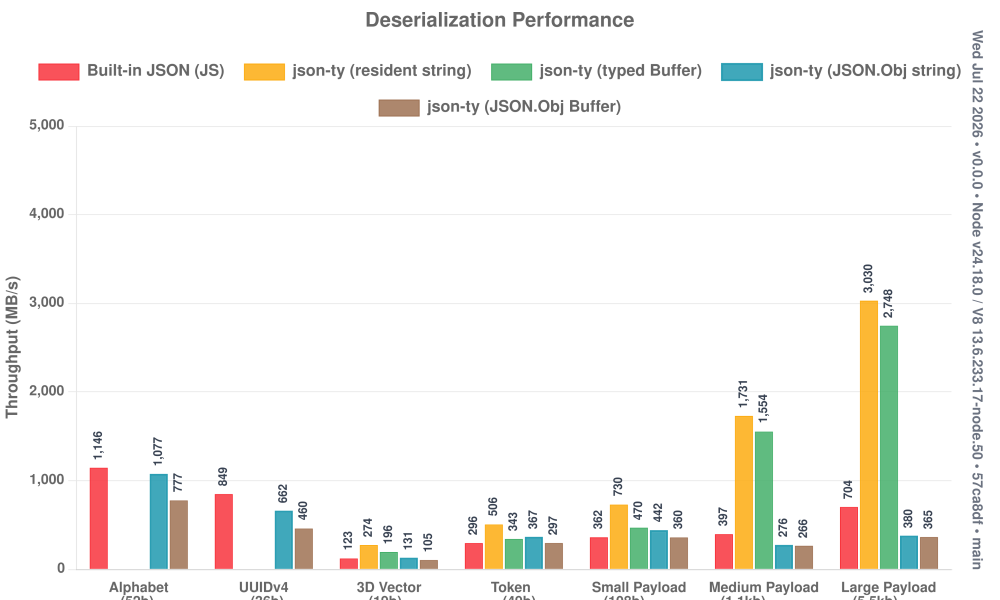
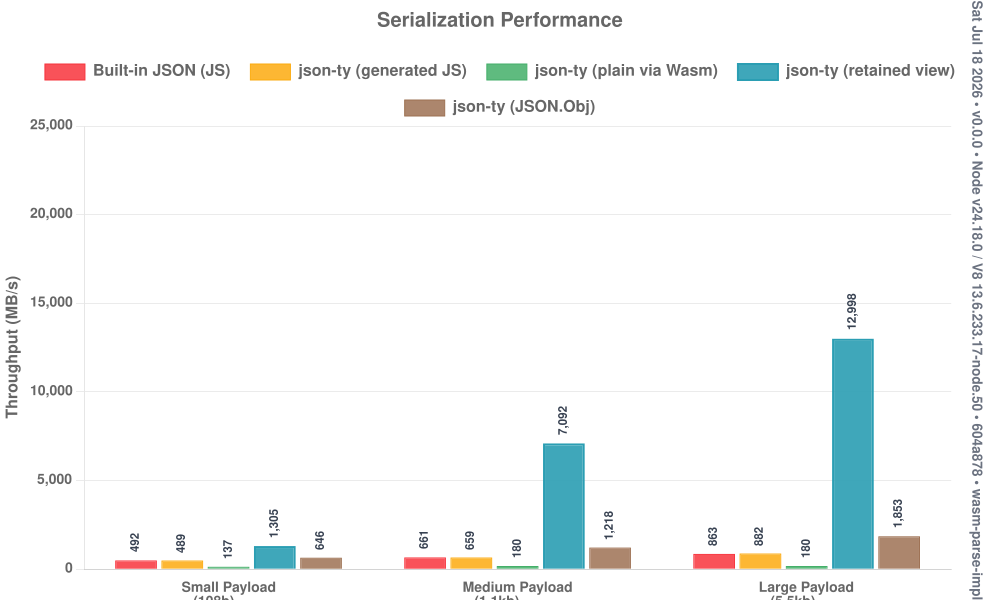
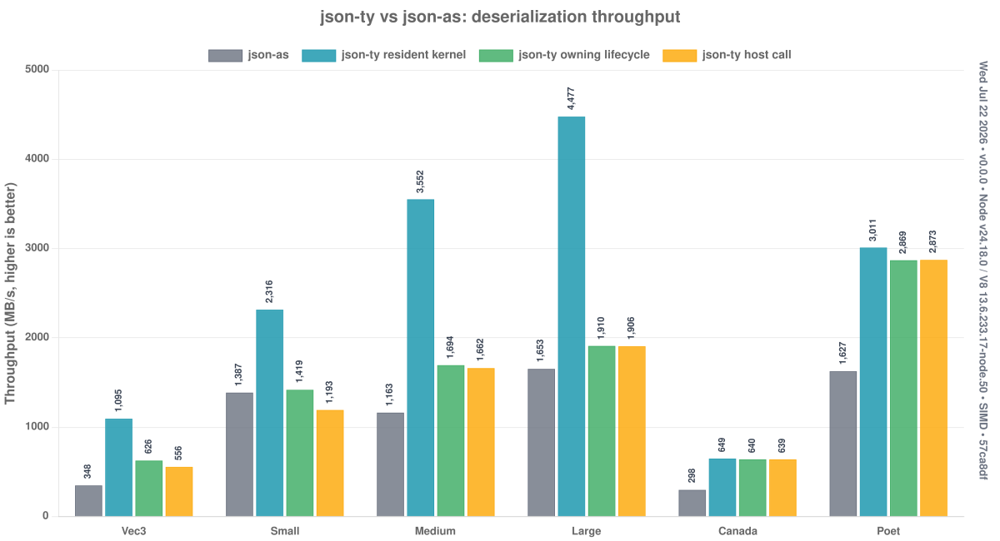
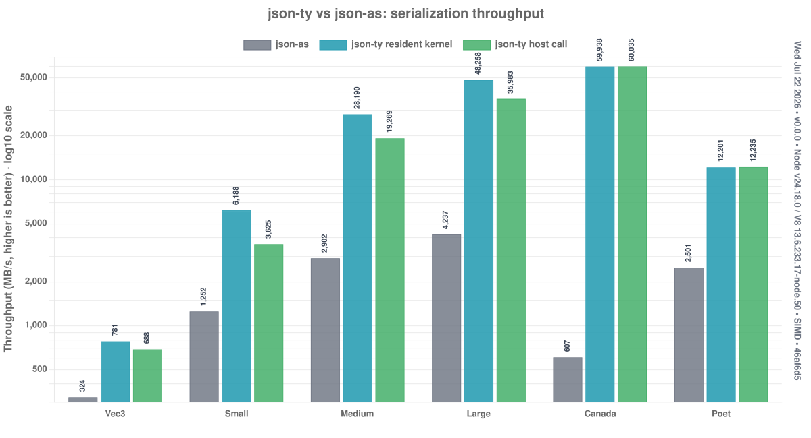
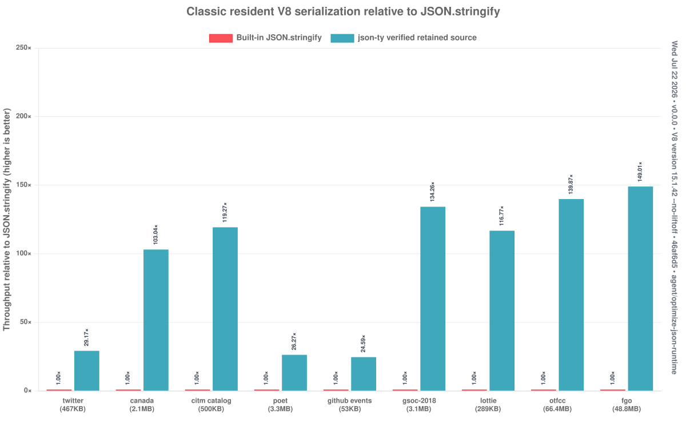

<h1 align="center"><pre> ╦╔═╗╔═╗╔╗╔ ╔╦╗╦ ╦
 ║╚═╗║ ║║║║══║ ╚╦╝
╚╝╚═╝╚═╝╝╚╝  ╩  ╩ </pre></h1>

<p align="center">
  <strong>Multi-GB/s JSON for TypeScript, backed by WebAssembly.</strong>
</p>

<p align="center">
  <a href="https://github.com/JairusSW/json-ty/actions/workflows/tests.yml"></a>
  <a href="./LICENSE"></a>
  
  
  
</p>

`json-ty` takes the basic typed forms of `JSON.parse<T>` and
`JSON.stringify<T>`, discovers their schemas with the TypeScript compiler, and
generates one application-specific AssemblyScript module plus matching host
bindings.

The generated WebAssembly reads and writes raw UTF-8. Parsed records live in a
flat, manually managed linear-memory graph—not AssemblyScript strings, arrays,
classes, or GC objects. JavaScript sees strongly typed views with normal field
access, mutation, class methods, and `instanceof`.

> **Status:** early and intentionally versioned `0.0.0`. Install directly from
> GitHub while the API and packaging settle. Node.js is the primary target; the
> generated artifact uses the portable SWAR tier and bulk memory by default;
> Wasm SIMD is an explicit compile-time tier.

<details>
<summary>Table of Contents</summary>

- [Installation](#installation)
  - [Configure ts-patch](#configure-ts-patch)
  - [Build modes](#build-modes)
  - [Transformer options](#transformer-options)
- [Quick Start](#quick-start)
- [What Gets Generated](#what-gets-generated)
- [How It Works](#how-it-works)
- [Schemas](#schemas)
  - [Classes](#classes)
  - [Interfaces and Type Aliases](#interfaces-and-type-aliases)
  - [Arrays and Tuples](#arrays-and-tuples)
  - [Dynamic JSON](#dynamic-json)
- [Decorators](#decorators)
  - [Aliases and Omission](#aliases-and-omission)
  - [Lazy Fields](#lazy-fields)
  - [Unknown Decorators](#unknown-decorators)
- [Object Behavior and Lifetime](#object-behavior-and-lifetime)
- [Performance](#performance)
- [Compatibility](#compatibility)
- [Debugging](#debugging)
- [Architecture](#architecture)
- [Contributing](#contributing)
- [License](#license)
- [Contact](#contact)

</details>

## Installation

Until the first registry release, install the repository directly:

```bash
npm i JairusSW/json-ty
npm i -D typescript@^6.0.3 ts-patch@^4.0.1
```

`json-ty` is ESM-first and requires Node.js 22.15 or newer. Builds use the
TypeScript 6 JavaScript compiler and ts-patch 4; the native TypeScript 7
compiler does not yet expose the transformer API json-ty needs.

> If the project already uses TypeScript 7, keep the TypeScript 6 compiler in a
> separate build workspace for now. Do not point ts-patch at the native
> TypeScript 7 package.

### Configure ts-patch

Add json-ty's transform to `tsconfig.json`. Keep it before transforms which
erase decorators, alter schema declarations, or rewrite typed JSON calls:

```json
{
  "compilerOptions": {
    "target": "ES2022",
    "module": "NodeNext",
    "moduleResolution": "NodeNext",
    "rootDir": "src",
    "outDir": "dist",
    "strict": true,
    "experimentalDecorators": true,
    "plugins": [
      { "transform": "json-ty/transform" }
    ]
  },
  "include": ["src/**/*.ts"]
}
```

json-ty is an ordinary program-aware ts-patch `before` transform. Additional
transforms can follow it in the same array:

```json
{
  "compilerOptions": {
    "plugins": [
      { "transform": "json-ty/transform" },
      { "transform": "another-transform" }
    ]
  }
}
```

Decorators that json-ty does not recognize are left in the tree for later
transforms. Fields affected by those decorators use the host-managed path so
their runtime descriptor behavior is retained.

### Build modes

The recommended setup uses ts-patch's live compiler. It does not modify the
installed TypeScript package:

```json
{
  "scripts": {
    "build": "tspc -p tsconfig.json",
    "watch": "tspc -p tsconfig.json --watch"
  }
}
```

If using the normal `tsc` command is important, persistently patch the local
TypeScript 6 installation instead:

```bash
npx ts-patch install
npx tsc -p tsconfig.json
```

The plugin performs whole-program schema analysis once per emit, generates the
AssemblyScript and host bindings, compiles the Wasm through the semantic cache,
and then rewrites each source file during normal TypeScript emit. On a cache hit
no AssemblyScript process is started.

The standalone `json-tyc -p tsconfig.json` command remains available for
debugging or build systems that want json-ty to own the complete emit, but
ts-patch is the canonical integration.

### Transformer options

Options live directly on the `json-ty/transform` plugin entry:

```json
{
  "compilerOptions": {
    "plugins": [
      {
        "transform": "json-ty/transform",
        "generatedDirectory": ".json-ty",
        "cacheDirectory": ".json-ty/cache",
        "kernelTier": "swar",
        "optimizeLevel": 3,
        "shrinkLevel": 0
      }
    ]
  }
}
```

| Option | Default | Purpose |
|---|---|---|
| `generatedDirectory` | `.json-ty` | AssemblyScript, Wasm, layouts, manifest, and host bindings |
| `cacheDirectory` | `<generatedDirectory>/cache` | Content-addressed compiled Wasm cache |
| `kernelTier` | `swar` | Compile-time kernel family: `naive`, `swar`, or `simd` |
| `optimizeLevel` | `3` | AssemblyScript/Binaryen optimization level, from `0` to `3` |
| `shrinkLevel` | `0` | Binaryen size-optimization level, from `0` to `2` |
| `runtimeModuleSpecifier` | generated relative path | Advanced override for the injected runtime import |

Relative directories are resolved from the `tsconfig.json` containing the
plugin entry. One generated Wasm module is shared by all schemas in that build
target.

## Quick Start

```ts
import { JSON, alias, json, omitnull } from "json-ty";

@json
class Vec3 {
  x = 0;
  y = 0;
  z = 0;
}

@json
class Player {
  @alias("display_name")
  name = "";

  score = 0;

  @omitnull
  position: Vec3 | null = null;

  greet(): string {
    return `hello ${this.name}`;
  }
}

const player = JSON.parse<Player>(
  '{"display_name":"Ada","score":42,"position":{"x":1,"y":2,"z":3}}',
);

console.log(player instanceof Player); // true
console.log(player.greet());            // hello Ada

player.score = 43;                      // fixed f64 store into linear memory
console.log(JSON.stringify<Player>(player));
// {"display_name":"Ada","score":43,"position":{"x":1,"y":2,"z":3}}

JSON.dispose(player);                   // deterministic document release
```

Build and run:

```bash
npm run build
node dist/index.js
```

Constructors are not invoked during parsing. The generated view is attached to
the declared class prototype, preserving methods and `instanceof` without
allocating a duplicate JavaScript object graph.

## What Gets Generated

The default build directory is `.json-ty/`:

```text
.json-ty/
├── schema-manifest.json   # deterministic TypeScript schema IR
├── schema-layouts.json    # shared host/Wasm memory contract
├── generated.ts           # inspectable generated AssemblyScript
├── runtime.wasm           # application-specific parser/writer
├── runtime.wat            # inspectable WebAssembly text
├── runtime.js             # Node binding and generated view classes
└── cache/<hash>/          # semantic build cache
```

The transform rewrites typed calls to compact, direct generated imports:

```ts
// source
const point = JSON.parse<Vec3>(input);
const text = JSON.stringify<Vec3>(point);

// conceptual output
import { p0 as __jsonTy_p0, s0 as __jsonTy_s0 } from "../.json-ty/runtime.js";
const point = __jsonTy_p0(input, Vec3);
const text = __jsonTy_s0(point);
```

The import path is calculated independently for every emitted source file, so
ordinary `src/` → `dist/` projects and nested modules resolve the same generated
runtime correctly.

## How It Works

```text
TypeScript Program + TypeChecker
              │
              ▼
      normalized schema IR
       ┌──────┼─────────┐
       ▼      ▼         ▼
 generated   host     typed-call
    AS       views    transform
       │      │         │
       ▼      └────┬────┘
 asc --runtime stub│
       │           │
       ▼           ▼
 runtime.wasm + runtime.js + emitted application JS
```

The analyzer resolves decorator symbols from `json-ty` imports, follows the
complete reachable type graph, evaluates JSON-literal defaults, and rejects
ambiguous schemas. The two code generators consume the same schema IR:

- AssemblyScript emitters specialize number, boolean, string, record, array,
  tuple, and union parsing/serialization.
- Host emitters specialize fixed-offset getters, setters, constructors, and
  direct Wasm bindings.

The maintained raw kernel library is separated into dedicated
`deserialize/`, `serialize/`, and `layout/` modules. Schema code calls those
`@inline` kernels rather than generating a second number or string algorithm
for every class.

Normal typed parse and stringify each cross the JS/Wasm boundary once.

## Schemas

### Classes

Classes must be explicitly marked. Merely mentioning an internal class from a
typed call never opts it into serialization by accident.

```ts
import { JSON, json } from "json-ty";

@json
class Vec3 {
  x!: number;
  y!: number;
  z!: number;
}

const vector = JSON.parse<Vec3>('{"x":1,"y":2,"z":3}');
```

With `strictPropertyInitialization`, use definite-assignment assertions as
above or provide defaults. Missing fields without defaults remain absent;
missing fields with JSON-literal defaults read the declared default.

Nested classes, inheritance, recursive records, discriminated unions, literal
types, enums, and concrete generic instantiations are supported. Every
structured type in the reachable graph must be explicit.

### Interfaces and Type Aliases

TypeScript cannot decorate interfaces or aliases, so mark them once with the
erased `JSON.schema<T>()` declaration:

```ts
import { JSON } from "json-ty";

interface Point {
  x: number;
  y: number;
}

JSON.schema<Point>();

const point = JSON.parse<Point>('{"x":10,"y":20}');
```

The marker is removed from emitted JavaScript.

### Arrays and Tuples

`T[]` returns a real JavaScript array. Struct elements remain lightweight typed
views, while native array mutation becomes authoritative after materialization.

```ts
const points = JSON.parse<Vec3[]>('[{"x":1,"y":2,"z":3}]');
points.push({ x: 4, y: 5, z: 6 });
JSON.stringify<Vec3[]>(points);
JSON.dispose(points);
```

Use `JSON.Array<T>` when you want an opt-in memory-backed facade instead:

```ts
const samples = JSON.parse<JSON.Array<number>>("[1,2,3]");
samples.at(1);       // 2
samples.set(1, 9);
samples.toArray();   // [1, 9, 3]
samples.dispose();
```

Nested arrays and statically known heterogeneous tuples are generated as typed
flat layouts.

### Primitive Roots

Primitive roots use the same typed call syntax as records and arrays:

```ts
const text = JSON.stringify<string>("");
const count = JSON.parse<number>("42");
const enabled = JSON.parse<boolean>("true");
const nothing = JSON.stringify<null>(null);
```

Strings, numbers, booleans, `null`, arrays, tuples, and schema-backed objects
are all valid top-level typed values.

### Dynamic JSON

Unknown-shape data is opt-in through `JSON.Value`, `JSON.Obj`, and `JSON.Arr`:

```ts
const object = JSON.parse<JSON.Obj>(
  '{"name":"Ada","items":[1,true,{"ok":true}]}',
);

console.log(object.get("name")?.value);      // Ada
console.log(object.get("items")?.toJS());    // [1, true, { ok: true }]
console.log(JSON.stringify<JSON.Obj>(object));

JSON.dispose(object);
```

Dynamic values use 16-byte tagged slots in the same manually managed document
format. They are not pulled into typed schemas unless explicitly requested.

`JSON.Raw` validates an already encoded JSON fragment and allows raw insertion
on supported host/dynamic paths:

```ts
const fragment = new JSON.Raw('{"x":1,"y":2}');
```

## Decorators

Known decorators are resolved by import identity, not textual spelling:

- `@json` / `@serializable`
- `@alias(name)`
- `@omit`
- `@omitnull`
- `@omitif(self => expression)`
- `@optional`
- `@lazy` / `@eager`
- `@raw`

### Aliases and Omission

```ts
import { alias, json, omit, omitif, omitnull } from "json-ty";

@json
class Account {
  @alias("user_name")
  name = "";

  role = 0;

  @omit
  internalToken = "";

  @omitnull
  note: string | null = null;

  @omitif((self: Account) => self.role === 0)
  adminPanel = false;
}
```

Pure `@omitif` predicates over defaulted, non-nullable number and boolean fields
compile directly into the Wasm writer. The supported expression subset includes
literals, field reads, arithmetic, comparisons, `&&`, `||`, and unary `!`, `+`,
and `-`. Captured mutable state is never embedded into Wasm.

### Lazy Fields

Use `@json({ lazy: "auto" })` to defer expensive fields until first access:

```ts
import { JSON, eager, json, lazy } from "json-ty";

@json({ lazy: "auto" })
class SearchResult {
  id = 0;                         // cheap scalar: eager
  items!: Item[];                 // expensive collection: deferred
  payload!: JSON.Lazy<Payload>;   // explicitly deferred

  @eager
  summary = "";                   // explicit eager override
}
```

Available class policies are `"none"`, `"auto"`, and `"all"`. `@lazy` and
`@eager` override the class policy per field. `@lazy({ auto: true })` and the
shorthand `@lazy({ auto })` are also accepted on classes.

The initial parse still validates the complete JSON grammar. A deferred value
is retained as a source-relative UTF-8 range, materialized by one generated Wasm
call on first access, then cached. An untouched range serializes directly from
the original bytes.

### Unknown Decorators

Decorators not imported from `json-ty` are preserved. A field affected by an
unknown runtime decorator becomes host-managed so its descriptor behavior is
not silently replaced by a linear-memory accessor.

Unsupported custom codec decorators likewise fall through unchanged. Arbitrary
user code is never moved into generated Wasm without an explicit supported
contract.

## Object Behavior and Lifetime

Generated class views support:

- typed reads and assignments;
- class methods and `instanceof`;
- stable repeated identity for decoded strings, nested objects, and arrays;
- concurrent live documents;
- stale-view protection after release;
- memory growth without invalidating document-relative references.

The fast default stores enumerable accessors on a shared prototype. It does not
promise native own-property descriptors, so `Object.keys` and spread may not
include untouched memory-backed fields. The lower-level binding also offers an
`objectShape: "enumerable"` mode when own-key compatibility matters more than
construction cost.

Release documents deterministically when their useful lifetime is clear:

```ts
JSON.dispose(value);
```

Plain values are a no-op. A `FinalizationRegistry` is only a best-effort
backstop; explicit release gives predictable memory reuse.

## Performance

`json-ty` is optimized for schema-directed workloads where parsing directly
into a flat document avoids constructing a full JavaScript object graph.

The latest three-payload overview run used Node.js 24.18 on the local x86-64
development machine. These are end-to-end host measurements, including the
Node/Wasm byte boundary:

| Payload | Native parse | Typed Buffer parse | Ratio | Resident string parse |
|---|---:|---:|---:|---:|
| Small | 364 MB/s | 546 MB/s | 1.50x | 723 MB/s |
| Medium | 392 MB/s | 1,546 MB/s | 3.94x | 1,764 MB/s |
| Large | 694 MB/s | 2,749 MB/s | 3.96x | 3,059 MB/s |





The serializer chart keeps the normal scale linear. Only extreme cached-view
outliers use an explicit broken/logarithmic outlier region; the whole chart is
never put on a log10 scale.

### json-as parity

The direct SIMD comparison runs json-ty and the sibling json-as artifacts on
the same payloads and process. Its parse kernel consumes resident caller-owned
bytes and writes into a caller-owned bounded document span; the separately
reported owning path retains the convenient allocate-and-copy lifecycle. The
current resident-kernel gate passes all 12 parse/serialize rows at the required
1.50x floor:

- parsing: 1.56x–3.48x json-as across the checked schemas;
- serialization: 2.56x–98.91x on unchanged verified documents.





`RawNodeBinding.parseInto(schema, source, length, output, capacity)` exposes
the validating low-level contract. `{ trusted: true }` additionally asserts
that the caller has already validated canonical JSON and UTF-8, enabling the
fastest SWAR/SIMD boundary scans. Input and output must not overlap and must
remain reserved and alive for the document lifetime.

The very large serialization ratios are the intended retained-document path:
the first write is generated and byte-verified; later unchanged writes may copy
the proven canonical source. Mutations invalidate that state.

Performance depends heavily on payload shape and access pattern. Plain tiny
objects, fully materialized lazy documents, and dynamic JSON can favor native
V8. `parseDynamic(input, { plain: true })` deliberately uses the host JSON
backend because copying a completed Wasm graph into ordinary host objects adds
an unavoidable second allocation pass. Byte inputs still receive fatal UTF-8
validation. Dynamic parsing constructs the complete queryable flat-memory graph
in one Wasm pass by default. Use
`parseDynamic(bytes, { eager: false, validate: true })` only when explicitly
choosing retained nested spans and on-demand materialization. Validation is
mandatory and enabled by default—`validate: false` and trusted-byte bypasses
are unsupported. Typed views, lazy views, `JSON.Obj`, and raw-byte output remain
Wasm-backed; generated JavaScript handles ordinary-object serialization when
flattening it into Wasm would lose.

Run the suites locally:

```bash
npm run bench:overview
npm run bench:parity
npm run bench:lazy
npm run bench:classic
npm run bench:classic:v8       # resident d8 loops with anti-elision sinks
npm run bench:tiers           # full naive/SWAR/SIMD report
npm run bench:tiers:smoke     # abbreviated cross-tier report
npm run bench:all             # full tiers, kernel microbenches, and all charts
npm run charts:publish        # publish versioned charts through an isolated docs worktree
npm run test:rfc-oracle       # all 318 JSONTestSuite cases, all tiers
```

The resident V8 classic gate now passes every corpus against both built-in JS
and the fastest sibling json-as SIMD mode. Validated, queryable `JSON.Obj`
parsing is 2.14–5.11× `JSON.parse`; typed-lazy and exact raw-projection paths
put the best semantic result at 1.51–3.15× json-as. Retained-source
serialization is 24.59–149.01× `JSON.stringify` and 2.46–5.86× json-as.
Validation-only scanner figures remain separately labeled and are not used to
satisfy the semantic parity gate.




Additional published charts cover the complete classic corpus, lazy access
patterns, raw API paths, tier execution, compile time, Wasm size, and RFC
coverage under [`benchmark/charts`](./benchmark/charts).

Results and methodology live in [bench/README.md](./bench/README.md).

## Compatibility

Implemented:

- `number`, `boolean`, `string`, nullability, optionals, and JSON-literal defaults;
- classes, interfaces, aliases, inheritance, concrete generics, and recursion;
- real arrays, memory-backed arrays, nested arrays, and tuples;
- discriminated object unions, literal types, and enum representations;
- typed and dynamic JSON, raw host insertion, lazy parsing, and supported decorators;
- Node Buffer/string ingress and a lower-level browser byte bridge.

Build compatibility:

- TypeScript 6 plus ts-patch 4 is supported and tested with multiple ordered transforms.
- Native TypeScript 7 is not currently supported because it has no compatible
  synchronous source-transformer API.
- `json-ty/transform` options include `generatedDirectory`, `cacheDirectory`,
  `runtimeModuleSpecifier`, `kernelTier`, `optimizeLevel`, and `shrinkLevel`. Relative paths
  are resolved from the owning `tsconfig.json`.

Deliberately outside the current basic contract:

- revivers, replacers, and pretty-print spacing;
- unconstrained `any`, functions, symbols, index signatures, and untagged unions;
- dedicated Date, Map, Set, typed-binary, and arbitrary custom-Wasm codecs;
- CommonJS packaging and precompiled application-independent Wasm artifacts.

See [FEATURE_MATRIX.md](./FEATURE_MATRIX.md) for the exact support matrix.

## Debugging

The generated implementation is intentionally inspectable:

- `.json-ty/schema-manifest.json` shows what the TypeScript analyzer discovered.
- `.json-ty/schema-layouts.json` shows field offsets and ABI names.
- `.json-ty/generated.ts` shows the specialized AssemblyScript.
- `.json-ty/runtime.wat` shows the optimized WebAssembly.

Common failures:

- **Decorators remain or typed calls are untouched:** the build ran through an
  unpatched `tsc`; use `tspc`, or run `ts-patch install` against TypeScript 6.
- **Unsupported TypeScript compiler:** install `typescript@^6.0.3`. The native
  TypeScript 7 compiler is intentionally rejected until compatible transformer
  hooks exist.
- **Another transform cannot see its decorator:** place json-ty before that
  transform. json-ty removes only its own imported decorators and preserves
  unknown decorators.
- **Schema not found:** import `@json` from `json-ty`, or add
  `JSON.schema<T>()` for an interface/type alias.
- **Structured dependency rejected:** every class in a typed graph must be
  explicitly marked.
- **Uninitialized class field:** use `field!: T`, provide a default, or adjust
  `strictPropertyInitialization`.
- **Call was not optimized:** use an explicit type argument:
  `JSON.parse<MyType>(input)`.
- **Wasm fails to compile:** generated builds require bulk-memory support;
  choose `kernelTier: "simd"` only on runtimes with Wasm SIMD.
- **Deployment cannot find runtime.wasm:** ship the generated `.json-ty/`
  runtime artifacts beside the emitted application layout; only `cache/` is
  disposable.

## Architecture

The short version:

```text
Node Buffer/string
      │ raw UTF-8
      ▼
schema-specialized Wasm parser
      │
      ▼
flat relative-offset document in WebAssembly.Memory
      │ fixed masks/offsets
      ▼
generated TypeScript view
```

WebAssembly uses the AssemblyScript stub runtime, imported memory, a reusable
operation scratch region, and an explicit persistent allocator. It imports only
memory and the rare correctly-rounded long-number fallback. There is no
`@assemblyscript/loader`, managed schema object, or GC graph.

Read [ARCHITECTURE.md](./ARCHITECTURE.md) for the memory layout, parser tiers,
canonical-source protocol, lazy materialization, host lowering, and ABI.

## Verification

```bash
npm run typecheck
npm run test:all
npm run bench:parity
```

The release gate includes raw ABI/import checks, Node and browser bindings, all
318 pinned JSONTestSuite parsing fixtures through typed and dynamic APIs,
generated-project integration, wide schemas, multiword bitmaps, naive/SWAR/SIMD
differential checks, number/string edge cases, mutation, lifetime safety, and
build-cache determinism.

## Contributing

Contributions are welcome—especially correctness reductions, schema/type
coverage, host-boundary improvements, and benchmark-backed kernel work.

Please read [CONTRIBUTING.md](./CONTRIBUTING.md) and
[CODE_OF_CONDUCT.md](./CODE_OF_CONDUCT.md). Performance changes should include
before/after numbers and must keep the naive/SWAR/SIMD differential suites green.

Contributors are recognized in [CONTRIBUTORS.md](./CONTRIBUTORS.md).

## License

[MIT](./LICENSE) © 2026 [Jairus Tanaka](https://github.com/JairusSW).

## Contact

- Issues: <https://github.com/JairusSW/json-ty/issues>
- Discussions: <https://github.com/JairusSW/json-ty/discussions>
- Email: [me@jairus.dev](mailto:me@jairus.dev)
- Sponsor: <https://github.com/sponsors/JairusSW>
