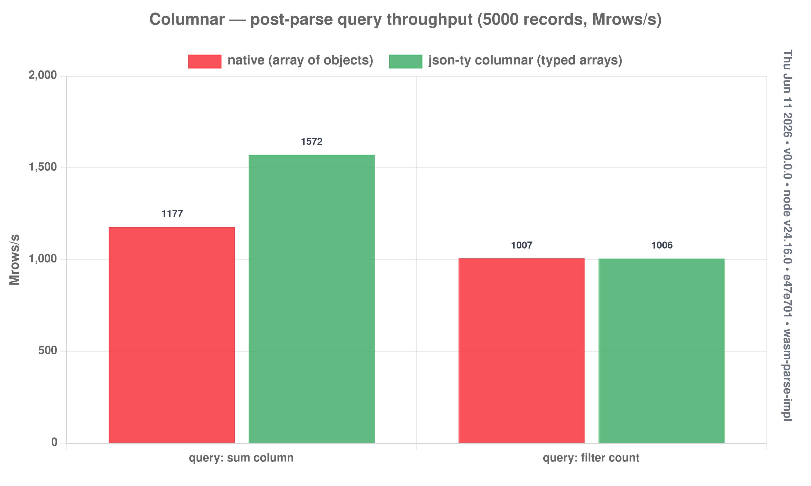

# Columnar / dataframe-lite

The eager flat buffer stores an array of records row-major (`[count][M]` + slots),
so a column is just a strided read. `parseColumnar` (in `src/wasm/eager-rt.js`)
parses the array once, then pulls whole columns out:

```js
const df = parseColumnar(SID, json);
const x = df.numCol(1);          // packed Float64Array (one strided copy)
df.sum(2);                       // strided, no allocation
df.countWhere(4, v => v !== 0);  // predicate over a column
df.strCol(3);                    // string[]
```

```bash
node experiments/columnar/bench.mjs [N]   # default 5000
```

## Results (5000 records, ~290 KB)



| workload | native | columnar | speedup |
|----------|-------:|---------:|--------:|
| end-to-end (parse + sum+mean+count) | 238 MB/s | 475 MB/s | **1.99×** |
| post-parse query: sum column | 1198 Mrows/s | 1568 Mrows/s | 1.31× |
| post-parse query: filter count | 1014 Mrows/s | 1004 Mrows/s | 0.99× |

## The honest finding

The win is in the **parse** (≈2× end-to-end — eager flat tables, no JS objects
built). **Post-parse JS iteration is barely faster**, and that's the interesting
part: **V8 optimizes monomorphic object access so well** (hidden classes) that
`obj.x` over a `JSON.parse`'d array nearly matches `Float64Array[i]`. Columnar
doesn't beat native at *scalar JS loops*.

Where columnar actually pays off:

- **Parse throughput** — 2× end-to-end, and the column is materialized as a real
  `Float64Array` for free (native would need an extra extraction pass).
- **Interop** — that `Float64Array` drops straight into typed-array consumers
  (WASM/SIMD kernels, WebGL/GPU, TensorFlow.js, plotting libs) with **no copy**.
  An array-of-objects must be unpacked first.
- **Memory** — `N×8` bytes per numeric column vs `N` heap objects (header +
  pointers + boxed fields).

So: reach for columnar when the data is **numeric and headed for a typed-array
consumer**, not to speed up a plain JS `for` loop — V8 already wins that one.
