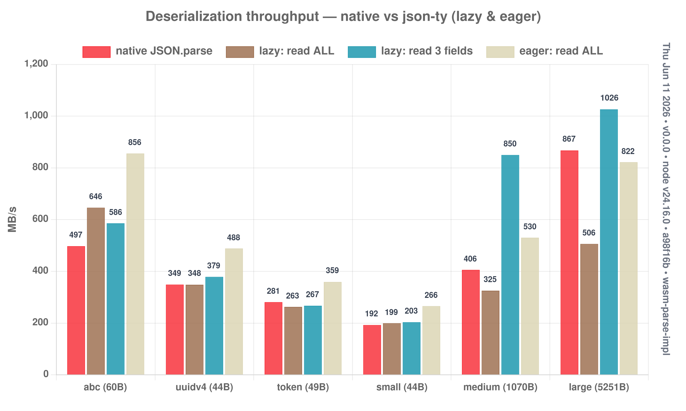

# Deserialization bench (json-as payloads)

Payloads ported from json-as (`bench/*.bench.ts`): `abc`, `uuidv4`, `token`,
`small`, `medium`, `large` (a github repo response). `abc`/`uuidv4` are bare
strings wrapped as `{"v": …}` so the object engine applies. A schema is
auto-derived from each payload (`autoSchema`) so we don't hand-write large's ~80
fields.

```bash
node experiments/deserialize/bench.mjs   # -> build/logs/deserialize.json
node experiments/deserialize/chart.mjs   # -> deserialize.png
```

## Results (Node, MB/s)



| payload | bytes | native | lazy: read ALL | lazy: read 3 | **eager: read ALL** |
|---------|------:|-------:|---------------:|-------------:|--------------------:|
| abc     | 60    | 497    | 646 (1.30×)    | 586 (1.18×)  | **856 (1.72×)**     |
| uuidv4  | 44    | 349    | 348 (1.00×)    | 379 (1.09×)  | **488 (1.40×)**     |
| token   | 49    | 281    | 263 (0.93×)    | 267 (0.95×)  | **359 (1.28×)**     |
| small   | 44    | 192    | 199 (1.04×)    | 203 (1.06×)  | **266 (1.38×)**     |
| medium  | 1070  | 406    | 325 (0.80×)    | 850 (2.09×)  | **530 (1.31×)**     |
| large   | 5251  | 867    | 506 (0.58×)    | **1026 (1.18×)** | 822 (0.95×)     |

## Reading the chart (honestly)

- **`native` is flat** — `JSON.parse` always materializes the whole document.
- **lazy `read ALL` is the worst case** — materializing every field (large is ~80
  mostly-URL strings) loses to native's single C++ pass on big docs (0.58×).
- **lazy `read 3` is the partial-access design target** — medium **2.09×**, large
  **1.18×**: skip the fields native eagerly parses.
- **`eager: read ALL` is the full-deserialize answer** — flat pointer-linked
  tables, no per-field `decodeSlot`/`Map`. It beats lazy-full on *every* payload
  and native on 5 of 6 (1.3–1.7×); on `large` it's ~par (0.95×) because this
  bench reads via dynamic `o[name]` getter access — the raw index reader hits
  1.3× (see `../eager-parse`).

Net: **lazy** for partial access, **eager** for full deserialize. Both via
`JSON.parse<T>` (`@json` vs `@json({ eager: true })`); native only stays ahead on
a wide, string-heavy doc read in full.

A real per-field-access cost worth noting: each getter currently builds a small
`{tag,off,len,ptr}` object in `decodeSlot` + a memo `Map` — measurable on the
read-ALL path (~80 allocs). Decoding into primitives (no object) is the obvious
next optimization for the full-read case.
