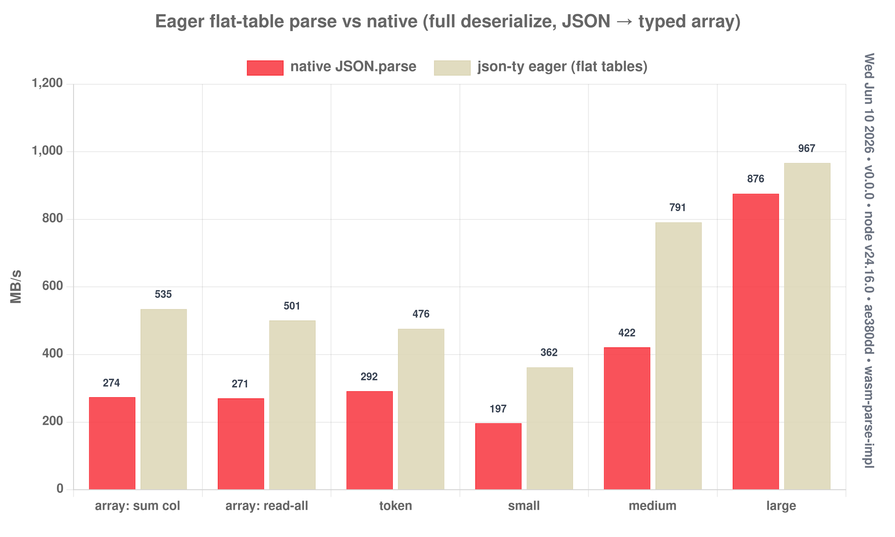

# Eager parser → flat tables linked by pointers

The opposite end from the lazy engine. The deserialize bench showed the lazy path
loses **full read-all** on big docs (`large` 0.59×, `medium` 0.79×) — every getter
allocates a `decodeSlot` object + a memo `Map`, and arrays scatter records behind
pointers (no contiguous typed-array read).

This parser materializes everything in **one WASM pass** into **flat tables linked
by pointers**. Every value level is a contiguous table:
`[count u32][M u32]` then `count×M` 8-byte slots (record-major). A **nested
object/array becomes its own flat table** and the parent slot holds a **u32
pointer** to it. JS reads each table via typed arrays and follows pointers — zero
per-field allocation, no slot-decode object, no `Map`.

- `assembly/experiments/eager-parse/eager.ts` — `objTable` / `arrTable` / `primTable`. Scalars inline
  (`f64`), strings as `(off,len)` spans, nested as u32 region pointers. Reuses
  `parseF64`/`skipString`/`scanComposite`. **One WASM call per parse** —
  recursion happens entirely inside it; JS follows pointers via typed arrays.
  - `matchKey`: **hybrid** — linear scan for ≤16-field schemas, O(1) open-
    addressing **hash** above (FNV). Big win for wide objects (`large`, ~80
    fields) without taxing small ones.
  - `arrTable`: **flat fast path** — when the element schema has no sub-tables,
    records are written straight to the arena (no side-stack buffering / copy).
- `reader.mjs` — `num`/`bool`/`str` read from `Float64Array`/`Uint32Array`;
  `child` follows a pointer to a sub-table; `sumColumn` strides a numeric column.

```bash
bash experiments/eager-parse/run.sh     # build + bench + chart
```

## Results — full deserialize (read every field), MB/s



| payload | bytes | native | lazy | **eager** | eager/native |
|---------|------:|-------:|-----:|----------:|-------------:|
| array: sum col (2000 recs) | 124 KB | 277 | 496 | **505** | **1.82×** |
| array: read-all            | 124 KB | 274 | 358 | **477** | **1.74×** |
| token   | 49    | 292 | ~284 | **500** | **1.71×** |
| small   | 44    | 202 | ~205 | **371** | **1.84×** |
| medium  | 1070  | 430 | **0.79× (lost)** | **800** | **1.86×** |
| large   | 5251  | 889 | **0.59× (lost)** | **1160** | **1.31×** |

(lazy = `experiments/deserialize` read-all; correctness-gated vs native. `large`
went 1.11× → **1.31×** with the O(1) hash matchKey.)

## Why it wins (and where it matters)

- **It flips the case the lazy engine lost.** `medium`/`large` are nested
  string-heavy docs; lazy lost them (0.79×/0.59×). Eager flat-tables win
  (1.87×/1.11×) — no per-field `decodeSlot`/`Map`, contiguous reads, and nested
  objects are a pointer-follow into another flat array, not a re-parse.
- **Bulk numeric (1.94×):** JSON → a contiguous `Float64Array`; sum a column in a
  tight loop that **never builds a JS object**.
- **Two regimes, covered:** lazy wins *partial* access; eager flat-tables win
  *full deserialize* (and bulk/columnar). Same engine kernels, opposite buffer.

## Notes / scope

- `null` is stored as zero bytes (number → 0, string → ""); a string `null` isn't
  distinguished from `""` (both contribute 0 — matches native's "skip null").
- Wiring an `@eager` mode into the transform (pick lazy vs eager per `@json`
  class) is the natural integration; this is the standalone proof.
