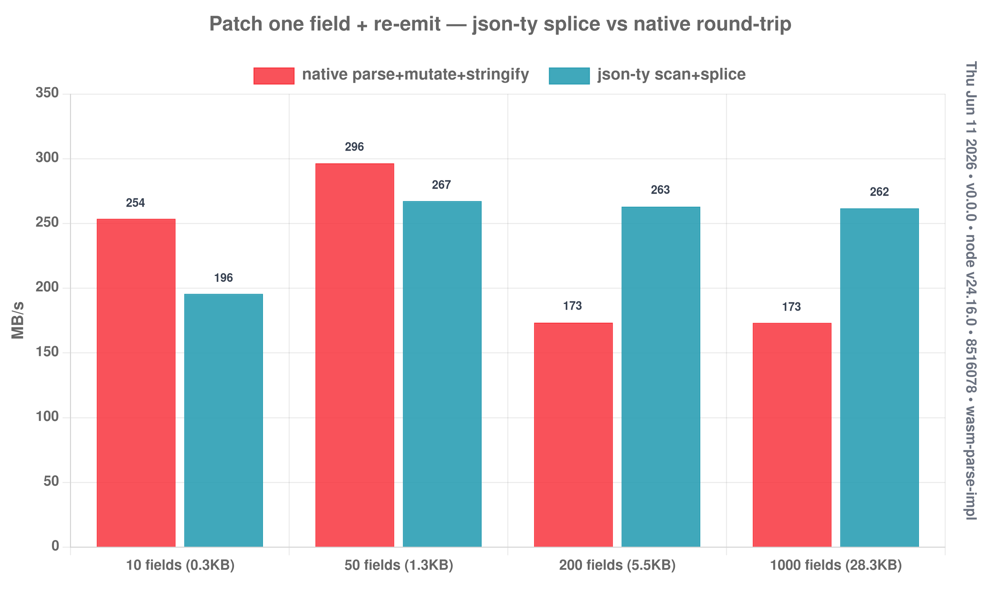

# Mutable in-place document (pass-through patch)

The "never fully leave the bytes" idea from `experiments/PROTOCOL.md`. Instead of
`JSON.parse → mutate → JSON.stringify` (build the whole object tree, then
re-serialize all of it), scan the top-level field **value spans** once and patch
by **splicing the source**:

```js
const doc = parseDoc(keys, json);   // wasm scans value spans
doc.set("status", "blocked");       // record an edit (no parse)
const out = doc.emit();             // splice source: [prefix][new value][suffix]
doc.get("user");                    // parse just one field, on demand
```

`spanObject` (in `src/wasm/eager.ts`) records each field's `(off,len)` byte span;
`parseDoc` (in `src/wasm/eager-rt.js`) does the edit-overlay + splice. ASCII docs
(byte offset == char offset).

```bash
node experiments/mutable-doc/bench.mjs
```

## Results — patch one field + re-emit (MB/s)



| doc | native (parse+mutate+stringify) | json-ty (scan+splice) | speedup |
|-----|--------------------------------:|----------------------:|--------:|
| 10 fields (0.3 KB) | 254 | 196 | 0.77× |
| 50 fields (1.4 KB) | 296 | 267 | 0.90× |
| 200 fields (5.7 KB) | 173 | 263 | **1.52×** |
| 1000 fields (29 KB) | 173 | 262 | **1.51×** |

## The honest read

- **json-ty is flat (~262 MB/s) regardless of size** — it's bandwidth-bound: scan
  the spans, copy the doc once with a substitution. **native degrades** (296 →
  173) as the doc grows, because it allocates and walks a bigger object tree and
  re-escapes/serializes every field. So the advantage *widens* with doc size.
- **It's not a 10× blowout, and that's expected:** re-emitting a *full* document
  is inherently O(size) for everyone — you still have to produce all the output
  bytes. The win is the constant factor: no object tree, no re-serialization.
- **The under-counted win is allocation.** json-ty builds essentially *zero* JS
  objects — native allocates ~one object + N strings per message. For a gateway
  /proxy/redactor doing this on a hot path, the **GC pressure** difference matters
  as much as the throughput.
- **Small docs lose** (the wasm call + overlay overhead isn't amortized) — use
  native below ~a few KB.

## Path to a bigger win (future)

The O(size) wall is the JS-string output. If the emit target is **bytes**
(a socket/file), the segments `[prefix][value][suffix]` can be written with
scatter-gather (`writev`) straight from the source buffer + the patch — no
concatenated JS string at all. That's where pass-through genuinely pulls away;
a string-returning microbench can't show it.
