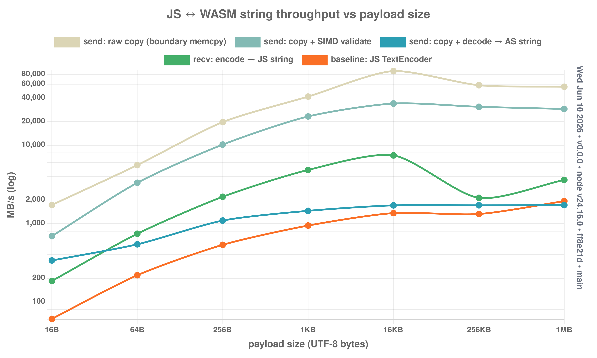

# Experiment: JS ↔ WASM string boundary throughput

**Question:** is it worth offloading json-ty's (de)serialization to WASM the way
[json-as](../../../json-as) does for AssemblyScript? The hard ceiling on any
such design is how fast string bytes can cross the JS↔WASM boundary and be
transcoded between JS's UTF-16 and JSON's UTF-8. This measures exactly that,
using [`utf-as`](https://www.npmjs.com/package/utf-as) (SIMD UTF-8/16) for the
transcode.

## Setup

- `assembly/experiments/string-bridge/bridge.ts` — tiny AS module: a stable 64 MiB scratch buffer plus
  `ingestUtf8` (JS→WASM: decode UTF-8 → AS string), `validateUtf8` (SIMD scan,
  no allocation), and `emitUtf8` (WASM→JS: encode the held string → UTF-8).
- Built with **`--runtime stub`** (bump allocator, no GC — max allocation
  throughput) and `--enable simd`.
- `bench.mjs` — Node harness. Re-instantiates per payload (stub never frees) and
  pre-grows memory so the `Uint8Array` view can't detach mid-loop. All numbers
  are **MB/s of UTF-8 bytes moved**.

```bash
# build (asc resolves utf-as via a direct path import — see bridge.ts)
npx asc assembly/experiments/string-bridge/bridge.ts \
  --outFile experiments/string-bridge/build/bridge.wasm \
  -O3 --noAssert --bindings raw --runtime stub --exportRuntime \
  --enable simd --enable bulk-memory

node experiments/string-bridge/bench.mjs     # throughput table + JSON log
node experiments/string-bridge/chart.mjs     # -> string-bridge.png
```

## Results (V8 / Node 24, this machine)



| payload | send copy | send+validate | send+ingest | recv+read | js encode |
|--------:|----------:|--------------:|------------:|----------:|----------:|
| 16B     | 1.8 GB/s  | 0.7 GB/s      | **331 MB/s**| 206 MB/s  | 60 MB/s   |
| 256B    | 17 GB/s   | 11 GB/s       | 1.1 GB/s    | 2.3 GB/s  | 533 MB/s  |
| 1KB     | 40 GB/s   | 23 GB/s       | 1.5 GB/s    | 4.9 GB/s  | 938 MB/s  |
| 16KB    | 92 GB/s   | 33 GB/s       | 1.7 GB/s    | 7.4 GB/s  | 1.5 GB/s  |
| 1MB     | 56 GB/s   | 29 GB/s       | 1.7 GB/s    | 3.7 GB/s  | 2.1 GB/s  |

## Takeaways

1. **The boundary copy is not the bottleneck.** Moving raw bytes across
   JS↔WASM is a memcpy: 1.8 GB/s for tiny strings, tens of GB/s once the call
   overhead amortizes (90 GB/s at 16KB). Crossing the boundary is basically free.

2. **The wall is UTF-16↔UTF-8 transcode + string materialization.** The moment
   you decode bytes into an AS `string` (`send+ingest`) you hit a **~1.7 GB/s
   ceiling** regardless of size. Validating the same bytes *without* allocating
   a string (`send+validate`) stays at 33 GB/s — a 20× gap. The cost is the
   transcode and the AS string object, not the transfer.

3. **Small strings are murdered by per-call overhead.** At 16–64B (the size of a
   typical JSON field) every pipeline collapses: ingest 331 MB/s, recv 206 MB/s,
   even JS's own `TextEncoder` only manages 60 MB/s. json-ty's pure-JS
   `serializeString` already does ~340 MB/s on a 60B string **and emits the
   final JSON directly** — so a per-field WASM hop is strictly slower.

4. **A round trip pays both directions.** Serializing in WASM means send the
   data in *and* read the JSON out, so the realistic ceiling is roughly
   `min(send+ingest, recv+read)` ≈ 1.5 GB/s at best, far below where the boundary
   itself tops out.

## Conclusion for json-ty

WASM offload only pays off if it **never materializes per-field JS/AS strings** —
i.e. operate on one large UTF-8 byte buffer end-to-end (the 33 GB/s validate
lane), not field-by-field through `String` objects. For json-ty's typical small,
many-field objects, staying in pure JS wins: it skips the boundary, skips the
UTF-16↔UTF-8 transcode, and builds the JSON string V8 already wants.

This is the same reason the **lazy parse** direction is the more promising bet:
the win there is *not scanning* untouched bytes (the 33 GB/s validate-style
lane), never the per-value string materialization that caps out at 1.7 GB/s.
